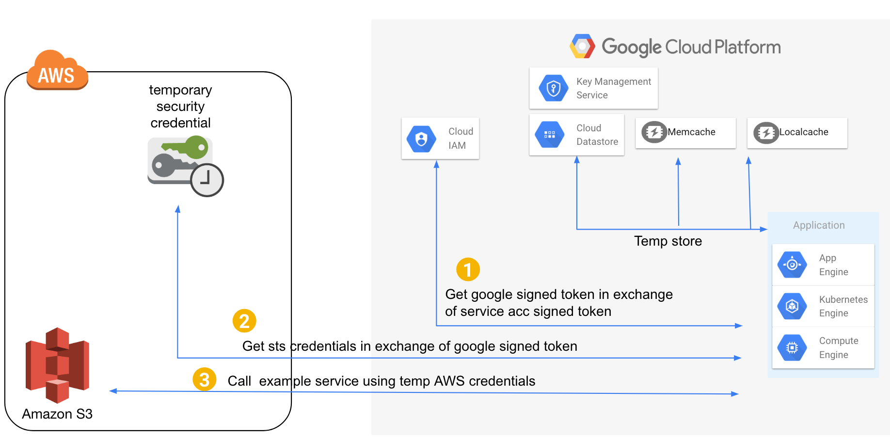
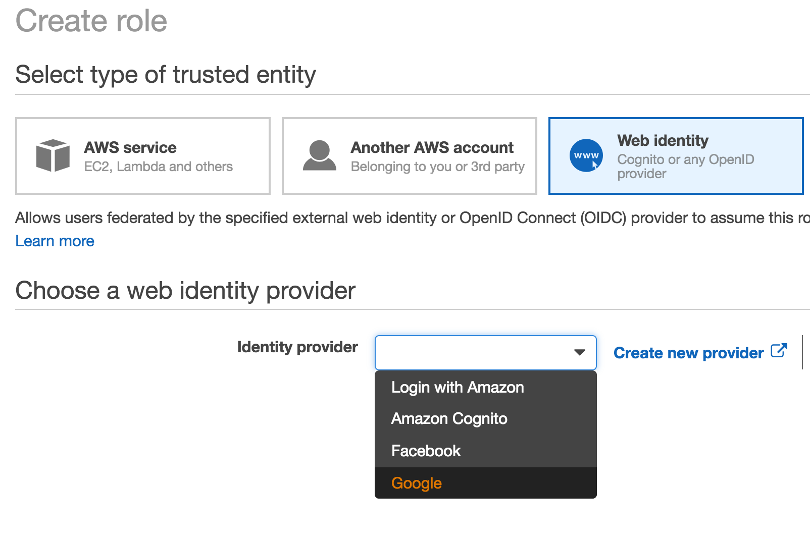
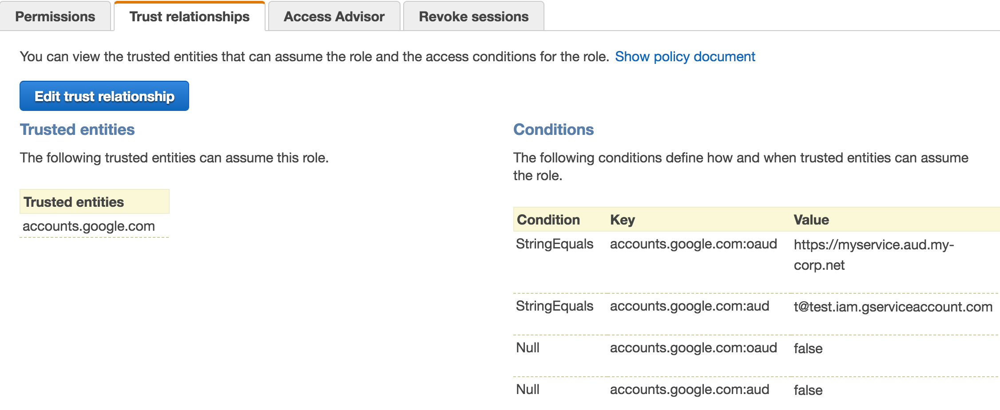

# Google Cloud to AWS authentication using Web Identity Federation

This sample shows how to make authenticated calls to AWS APIs from Google Cloud



> Note in above picture S3 is just example service. You can call any AWS API that supports auth based on AWS STS credentials.
> In GCP KMS, Datastore, Memcache are just shown for illustration purpose to suggest caching credentials in case of high QPS services.

## Why use Web Identity Federation
* Based on OpenID Connect open standard

## Use cases
* Securely call AWS APIs from outside AWS environment like Google Cloud or your data center.

## Google Cloud to AWS Federation
1. Create a signed JWT using your system’s service account keys. This can be local operation or using Google Cloud signJWT API call (in case of GCP managed keys)
    ```json
        {
            "iss": "<service account email>",
            "aud": "https://www.googleapis.com/oauth2/v4/token",
            "target_audience": "<Use the URI string used above in the oaud field>",
            "iat": "now",
            "exp": "<1 hour or some expiry, AWS allows max 1 hour>"
        }
    ```
2. Make call to "https://www.googleapis.com/oauth2/v4/token" to exchange above token for Google signed token
    ```json
        data = {
                  "grant_type": "urn:ietf:params:oauth:grant-type:jwt-bearer",
                  "assertion": "<above signed token>"
        }
    ```
3. Google should return you JWT which should look something like:
    ```json
        {
          "aud": "<URI that you used in above target_audience field>",
          "iss": "https://accounts.google.com",
          "email_verified": true,
          "exp": 1535578337,
          "azp": "<service account email that was mentioned in iss above>",
          "iat": 1535574737,
          "email": "<service account email that was mentioned in iss above>",
          "sub": "99992499378790129023"
        }
    ```
4. Make AWS STS WebIdentityFederation API call to retrieve temporary credentials
"https://sts.amazonaws.com/?DurationSeconds={DURATION}&Action=AssumeRoleWithWebIdentity&Version=2011-06-15&RoleSessionName={ROLE_SESSION}&RoleArn={ROLE_ARN}&WebIdentityToken={OPENIDTOKEN}"

    Where
    * ROLE_SESSION = Temporary identifier for this session. Helps in tracking when analyzing Cloudtrail events
    * ROLE_ARN = ARN role created in setup step 2 above
    * OPENIDTOKEN = Signed Token received from Google in prior step

You get AWS temporary credentials from above call that can be used to make signed requests to AWS
    ```
    <Credentials>
      <AccessKeyId>something-id</AccessKeyId>
      <SecretAccessKey>something-key</SecretAccessKey>
      <SessionToken>something-something</SessionToken>
      <Expiration>2017-12-22T04:02:22Z</Expiration>
    </Credentials>
    ```

## Environment for Sample to Work
* This example should work on Google Cloud Appengine Standard/Flex
* You can also try out locally.

## Prerequites
* Python 2.7 (should be easy to port to Python3)
* Python virtual environment
* Identity of your Google Cloud environment, service account should have `roles/iam.serviceAccountTokenCreator`
* Make note of Google account service account email, example `t@test.iam.gserviceaccount.com`
* Make note of target audience in your AWS environment. This could be any string in URI format, example `https://<myservice>.<my-corp.net>`

### For running Google Cloud commands
* [Google Cloud SDK](https://cloud.google.com/sdk/) is installed and `gcloud` commands work

## Setup
### AWS role setup
1. In your AWS account, create role wizard, choose `Web Identity` and from `Choose a web identity provider`, select `Google` as `Identity Provider`


2. For `Audience` field enter the Google Cloud environment's service account
3. Complete role creation, add role permissions as you wish
4. Edit `trust relationship` and add `oaud` condition as well as null checks.
5. Your trust policy should look something like below

```json
{
  "Version": "2012-10-17",
  "Statement": [
    {
      "Effect": "Allow",
      "Principal": {
        "Federated": "accounts.google.com"
      },
      "Action": "sts:AssumeRoleWithWebIdentity",
      "Condition": {
        "StringEquals": {
          "accounts.google.com:oaud": "https://myservice.aud.my-corp.net",
          "accounts.google.com:aud": "t@test.iam.gserviceaccount.com"
        },
        "Null": {
          "accounts.google.com:oaud": "false",
          "accounts.google.com:aud": "false"
        }
      }
    }
  ]
}
```


6. Make note of role arn `arn:aws:iam::<accountid>:role/<role name>`


## To run the sample locally
Install python dependencies
```bash
pip install -r requirements.txt
```

Setup required environment variables
```bash
export TARGET_AUDIENCE="https://<myservice>.<my-corp.net>"
```
`TARGET_AUDIENCE` should in URI format, example `https://myservice.aud.my-corp.net`

```bash
export AWS_ROLE_ARN="arn:aws:iam::<accountid>:role/<role name>"
```


If you are running locally, make sure you have created service account keys and exported environment variable
```bash
export GOOGLE_APPLICATION_CREDENTIALS=<path to your service account keys json>
```

Note, creating service account keys is not recommended best practice. This approach should only be used in local test environment.
Your test service account should have only least privileges

## To run the sample on Google Cloud Appengine Standard
Install python dependencies in vendored `lib` directory
```bash
pip install -r requirements.txt -t lib
```

#### Deploy to Google Cloud
Ensure [app-std.yaml](app-std.yaml) have `TARGET_AUDIENCE` and `AWS_ROLE_ARN` correctly set under `env_variables:` section

```bash
gcloud app deploy app-std.yaml --project <google cloud project id>
```

> Since you are running on appengine make sure you have correctly setup `aud` in the AWS role above. Generally GAE AppEngine has service account of format `<project id>g@appspot.gserviceaccount.com`

## To run the sample on Google Cloud Appengine Flexible
#### Local deploy
```bash
python main.py
```
Visit `http://127.0.0.1:8080`

> Note you would need `GOOGLE_APPLICATION_CREDENTIALS` environment for local environment to work

#### Deploy to Google Cloud
Ensure [app-flex.yaml](app-flex.yaml) have `TARGET_AUDIENCE` and `AWS_ROLE_ARN` correctly set under `env_variables:` section

```bash
gcloud app deploy app-flex.yaml --project
```

